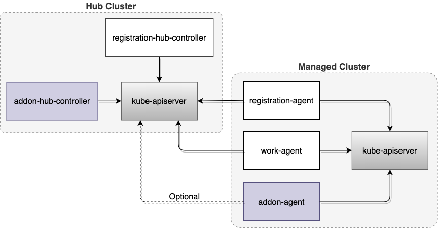
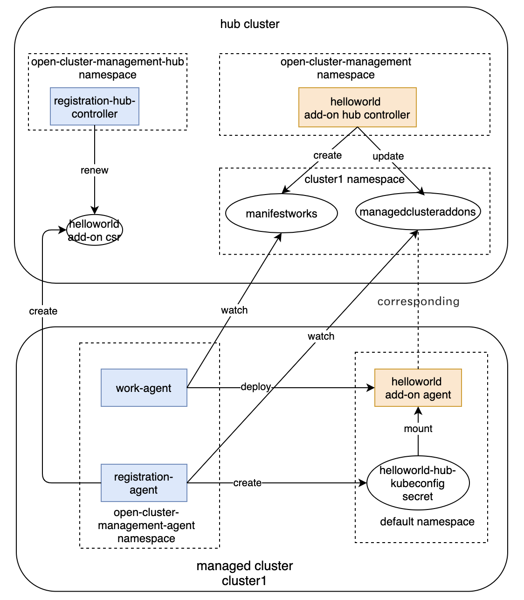

# Using Open Cluster Management add-on framework to develop your own managed cluster add-on

Authors: Qiu Jian, Yang Le and Wei Liu

## Open Cluster Management

[Open Cluster Management](https://open-cluster-management.io) is a community-driven project focused on multicluster and multicloud scenarios for Kubernetes apps. Open APIs are evolving within this project for cluster registration, work distribution, dynamic placement of policies and workloads, and much more. 

It enables any capability within the Kubernetes ecosystem to orchestrate itself across multiple clusters and cloud providers. Open Cluster Management provides core primitives to satisfy the above requirements to ease the multicluster enablement.

### Hub cluster

The hub cluster is the common term that is used to define the central controller that runs on a Kubernetes cluster.
The hub cluster aggregates information from multiple clusters by using an asynchronous work request model.

### Managed cluster

The managed cluster provides a representation of the managed cluster on the hub. ManagedCluster controls the lifecycle of whether the remote cluster has been "accepted" by the Hub for management and can retrieve information from the Hub to direct a set of manifests or actions to apply.

## What is an add-on

Open Cluster Management has a mechanism to help developers to develop an extension based on the foundation components for the purpose of working with multiple clusters in various aspects. The examples of add-ons includes:

- A tool to collect alert events in the managed cluster, and send them to the hub cluster.

- A network solution that uses a hub to share the network infos and establish connection among managed clusters.

- A tool to spread security policies to multiple clusters.

In general, if a management tool needs different configuration for each managed cluster or a secured communication between managed cluster and hub cluster, it can utilize the add-on mechanism in open-cluster-management to ease the installation and day 2 operation.

Normally, an add-on comprises of two components:

1. A controller running on a hub cluster (aka. addon-hub-controller);
2. An agent running on a managed cluster (aka. addon-agent);




As shown in the above diagram,  some foundation components from open-cluster-management are required as well to manage the lifecycle of an ad-don:

- `registration-hub-controller` on the hub cluster. It updates add-on status according to the status of cluster lease on hub.
- `registration-agent` on managed clusters. It helps to register the add-on on the hub cluster and creates a secret contraing hub kubeconfig for the add-on on the manated cluster. It also keeps updating the add-on status on hub cluster based on the add-on lease created on the managed cluster;
- `work-agent` on a managed cluster. It distributes a list of manifests from the hub cluster to the managed cluster and enforces them to be applied on the managed cluster for this add-on.

## How to develop an add-on

The easiest way to build an add-on is to leverage [addon-framework](), which is a library containing necessary interfaces and default implementation for add-on lifecycle management. In this section, we'll develop an example add-on `helloworld`. 

### Build addon-hub-controller

We start out with the [`AgentAddon`](https://github.com/open-cluster-management-io/addon-framework/blob/719dbb79d2759035c2e92f823a1722c6cc2a8e01/pkg/agent/inteface.go#L13) interface to develop an addon-hub-controller, .

```go
// AgentAddon defines manifests of agent deployed on managed cluster
type AgentAddon interface {
	// Manifests returns a list of manifest resources to be deployed on the managed cluster for this add-on
	Manifests(cluster *clusterv1.ManagedCluster, addon *addonapiv1alpha1.ManagedClusterAddOn) ([]runtime.Object, error)
	// GetAgentAddonOptions returns the agent options.
	GetAgentAddonOptions() AgentAddonOptions
}
```

The `Manifests` method is expected to return manifest resources which are required to deploy the addon-agent on a managed cluster. And `GetAgentAddonOptions` method returns add-on configuration including add-on name and registration option.

Create a struct with name [`helloWorldAgent`](https://github.com/open-cluster-management-io/addon-framework/blob/719dbb79d2759035c2e92f823a1722c6cc2a8e01/examples/helloworld/helloworld.go#L53) to implement the above interface.

```go
type helloWorldAgent struct {
	kubeConfig *rest.Config
	recorder   events.Recorder
	agentName  string
}
var _ agent.AgentAddon = &helloWorldAgent{}
```

Next, create an [`AddonManager`](https://github.com/open-cluster-management-io/addon-framework/blob/719dbb79d2759035c2e92f823a1722c6cc2a8e01/pkg/addonmanager/manager.go#L30), which is provided by [addon-framework](https://github.com/open-cluster-management-io/addon-framework), and register the agent we built before starting it.

```go
	mgr, err := addonmanager.New(controllerContext.KubeConfig)
	if err != nil {
		return err
	}
	agentRegistration := &helloWorldAgent{
		kubeConfig: controllerContext.KubeConfig,
		recorder:   controllerContext.EventRecorder,
		agentName:  utilrand.String(5),
	}
	mgr.AddAgent(agentRegistration)
	mgr.Start(ctx)
```

### Build addon-agent


Firstly, we'll create an [`agentController`](https://github.com/open-cluster-management-io/addon-framework/blob/719dbb79d2759035c2e92f823a1722c6cc2a8e01/examples/helloworld/helloworldagent.go#L102). It monitors configmaps in the cluster namespace on the hub cluster, and copy them to the `default` namespace on the managed cluster.

```go
type agentController struct {
	spokeKubeClient    kubernetes.Interface
	hunConfigMapLister corev1lister.ConfigMapLister
	clusterName        string
	recorder           events.Recorder
}
```

Next,  start an [`agentController`](https://github.com/open-cluster-management-io/addon-framework/blob/719dbb79d2759035c2e92f823a1722c6cc2a8e01/examples/helloworld/helloworldagent.go#L102) and a [`LeaseUpdater`](https://github.com/open-cluster-management-io/addon-framework/blob/719dbb79d2759035c2e92f823a1722c6cc2a8e01/pkg/lease/lease_controller.go#L24). The [`LeaseUpdater`](https://github.com/open-cluster-management-io/addon-framework/blob/719dbb79d2759035c2e92f823a1722c6cc2a8e01/pkg/lease/lease_controller.go#L24) creates a lease for add-on in the add-on install namespace and keeps updating it every 60 seconds.

```go
	// create an agent contoller
	agent := newAgentController(
		spokeKubeClient,
		hubKubeInformerFactory.Core().V1().ConfigMaps(),
		o.SpokeClusterName,
		controllerContext.EventRecorder,
	)
	// create a lease updater
	leaseUpdater := lease.NewLeaseUpdater(
		spokeKubeClient,
		"helloworld",
		"default",
	)
    go agent.Run(ctx, 1)
    go leaseUpdater.Start(ctx)
```

Now, we have covered major part of the `helloworld` add-on development. Click [here](https://github.com/open-cluster-management-io/addon-framework/tree/main/examples/helloworld) for the complete source code. Next we'll try to enable it.

## How to enable your developed add-on

After you finish your add-on development, it will be easy to enable it on your managed cluster by the `ManagedClusterAddOn` API. 

Next, let's use the `helloworld` add-on as an example to show how to deploy it in OCM.

1. Follow the [getting start](https://github.com/open-cluster-management-io/registration-operator#get-started-with-kind) of registration-operator to prepare a kind cluster and deploy the OCM on the kind cluster to manage itself.

2. After deployed OCM successfully, a managed cluster `cluster1` and its `certificatesigningrequest` will be created on the hub, 
   ```
   export KUBECONFIG=$HOME/.kube/config
   
   kubectl get managedcluster cluster1
   
   NAME       HUB ACCEPTED   MANAGED CLUSTER URLS   JOINED   AVAILABLE   AGE
   cluster1   true           https://localhost      True     True        20m
   ```

   and then, accept the managed cluster and approve its csr with the following command
   ```
   kubectl patch managedcluster cluster1 -p='{"spec":{"hubAcceptsClient":true}}' --type=merge
   
   kubectl get csr -l open-cluster-management.io/cluster-name=cluster1 | grep Pending | awk '{print $1}' | xargs kubectl certificate approve
   ```

3. Build a docker image of helloworld add-on on your local host, e.g.
   ```
   make images
   ```
   
   After this, an image `quay.io/open-cluster-management/helloworld-addon:latest` will be created.

4. Load the image to your kind cluster, e.g.
   ```
   kind load docker-image quay.io/open-cluster-management/helloworld-addon:latest
   ```

5. Deploy the helloworld add-on controller on hub cluster
   ```
   make deploy-example
   ```
   
   After this, the pod of helloworld add-on controller will be created on the `open-cluster-management` namespace, e.g.
   ```
   kubectl -n open-cluster-management get pods
   
   NAME                                     READY   STATUS    RESTARTS   AGE
   helloworld-controller-5857d64c7c-qxnzs   1/1     Running   0          47m
   ```

6. Enable the helloworld add-on on the managed cluster by the `ManagedClusterAddOn` API, e.g.
   ```
   cat << EOF | kubectl apply -f -
   apiVersion: addon.open-cluster-management.io/v1alpha1
   kind: ManagedClusterAddOn
   metadata:
     name: helloworld
     namespace: cluster1
   spec:
     installNamespace: default
   EOF
   ```
   
   After this, the helloworld add-on will be installed in the installation namespace `default` on the managed cluster, e.g.
   ```
   kubectl -n default get pods
   NAME                                READY   STATUS    RESTARTS   AGE
   helloworld-agent-79cf779b98-vgwz9   1/1     Running   0          36m
   ```
 
Now, we have enabled the helloworld add-on on the managed cluster.

Next, let's try it. We create a `configmap` `helloworld` in the managed cluster namespace `cluster1` on the hub cluster
```
cat << EOF | kubectl apply -f -
apiVersion: v1
kind: ConfigMap
metadata:
  name: helloworld
  namespace: cluster1
data:
  value: helloworld
EOF
```

Then the add-on will sync the `configmap` to the managed cluster, we can get it from the managed cluster, e.g.
```
kubectl -n default get cm helloworld -oyaml
apiVersion: v1
data:
  value: helloworld
kind: ConfigMap
metadata:
  creationTimestamp: "2021-07-06T06:42:04Z"
  managedFields:
  - apiVersion: v1
    fieldsType: FieldsV1
    fieldsV1:
      f:data:
        .: {}
        f:value: {}
    manager: helloworld
    operation: Update
    time: "2021-07-06T06:42:04Z"
  name: helloworld
  namespace: default
  resourceVersion: "32967"
  uid: f46d2e50-a29d-4b9b-9113-24219821b365
```

## How does the helloworld add-on work

After you applied the helloworld `ManagedClusterAddOn` on the hub cluster, the following process will be executed



- On the hub cluster, the [`AddonManager`](https://github.com/open-cluster-management-io/addon-framework/blob/719dbb79d2759035c2e92f823a1722c6cc2a8e01/pkg/addonmanager/manager.go#L30) started in addon-hub-controller calls back to the [`Manifests`](https://github.com/open-cluster-management-io/addon-framework/blob/main/examples/helloworld/helloworld.go#L63) method of `helloWorldAgent` we built to get the [manifest resources](https://github.com/open-cluster-management-io/addon-framework/blob/main/examples/helloworld/helloworld.go#L36) of `helloworld` add-on and creates the manifest work on the managed cluster namespace.
   ```
   kubectl -n cluster1 get manifestworks
   NAME                      AGE
   addon-helloworld-deploy   8m27s
   ```

- On the hub cluster, the [`AddonManager`](https://github.com/open-cluster-management-io/addon-framework/blob/719dbb79d2759035c2e92f823a1722c6cc2a8e01/pkg/addonmanager/manager.go#L30) calls back to the [`GetAgentAddonOptions`](https://github.com/open-cluster-management-io/addon-framework/blob/main/examples/helloworld/helloworld.go#L75) method of `helloWorldAgent` we built to get the registration information of the `helloworld` add-on and append it to the add-on status.
   ```
   kubectl -n cluster1 get managedclusteraddons helloworld -oyaml
   
   apiVersion: addon.open-cluster-management.io/v1alpha1
   kind: ManagedClusterAddOn
   ...
   status:
     registrations:
     - signerName: kubernetes.io/kube-apiserver-client
       subject:
         groups:
         - system:open-cluster-management:cluster:cluster1:addon:helloworld
         - system:open-cluster-management:addon:helloworld
         - system:authenticated
      user: system:open-cluster-management:cluster:cluster1:addon:helloworld:agent:8fmr7
   ```

- On the managed cluster, the `work-agent` watches the `manifestwork` of the helloworld add-on and deploys the helloworld addon-agent on the managed cluster.
   ```
   kubectl get clusterrolebindings helloworld-addon
   NAME               ROLE                           AGE
   helloworld-addon   ClusterRole/helloworld-addon   49m
   
   kubectl -n default get deploy,sa
   NAME                               READY   UP-TO-DATE   AVAILABLE   AGE
   deployment.apps/helloworld-agent   1/1     1            1           37m

   NAME                                 SECRETS   AGE
   serviceaccount/helloworld-agent-sa   1         37m
   ```

- On the managed cluster, the `registration-agent` get the registration information from the status of the helloworld add-on and creates a csr on the hub cluster
   ```
   kubectl get csr
   NAME                              AGE   SIGNERNAME                                    REQUESTOR                                       CONDITION
   addon-cluster1-helloworld-pgmt4   8s    kubernetes.io/kube-apiserver-client           system:open-cluster-management:cluster1:sdcnn   Approved,Issued
   ```

- On the hub cluster, the [`AddonManager`](https://github.com/open-cluster-management-io/addon-framework/blob/719dbb79d2759035c2e92f823a1722c6cc2a8e01/pkg/addonmanager/manager.go#L30) calls back to the function `CSRApproveCheck` of the [`Registration`](https://github.com/open-cluster-management-io/addon-framework/blob/main/examples/helloworld/helloworld.go#L80) to determine whether the CSR should be approved
  ```
  kubectl get csr
   NAME                              AGE   SIGNERNAME                                    REQUESTOR                                       CONDITION
   addon-cluster1-helloworld-pgmt4   8s    kubernetes.io/kube-apiserver-client           system:open-cluster-management:cluster1:sdcnn   Approved,Issued
  ```

- Once the CSR is approved, the `registration-agent` watches the approved CSR on the managed cluster and get the hub credentials from it, then the OCM registration-agent uses the hub credentials to create a hub kubeconfig and save it into a `secret` in the helloworld add-on installation namespace
   ```
   kubectl -n default get secrets
   NAME                              TYPE                                  DATA   AGE
   helloworld-hub-kubeconfig         Opaque                                3      5m45s
   ```

The helloworld addon-agent [mounts](https://github.com/open-cluster-management-io/addon-framework/blob/main/examples/helloworld/manifests/deployment.yaml#L20) the `secret` and uses the hub kubeconig of the `secret` to access to the hub kube-apiserver. And in day 2 operation, when the certificate of helloword add-on is about to expire, the `registration-agent` will send a request to rotate the certificate on the hub cluster, the addon-hub-controller on hub cluster will auto approve the certificate rotation request.

After the `helloworld` addon-agent was deployed on the managed cluster, the agent will create a `lease` in its installation namespace
```
kubectl -n default get leases
NAME         HOLDER   AGE
helloworld            7m52s
```

The `registration-agent` uses this lease to maintain the status of helloworld add-on on hub cluster.
```
kubectl -n cluster1 get managedclusteraddons helloworld -oyaml
apiVersion: addon.open-cluster-management.io/v1alpha1
kind: ManagedClusterAddOn
...
  - lastTransitionTime: "2021-07-09T02:52:49Z"
    message: helloworld add-on is available.
    reason: ManagedClusterAddOnLeaseUpdated
    status: "True"
    type: Available
```
